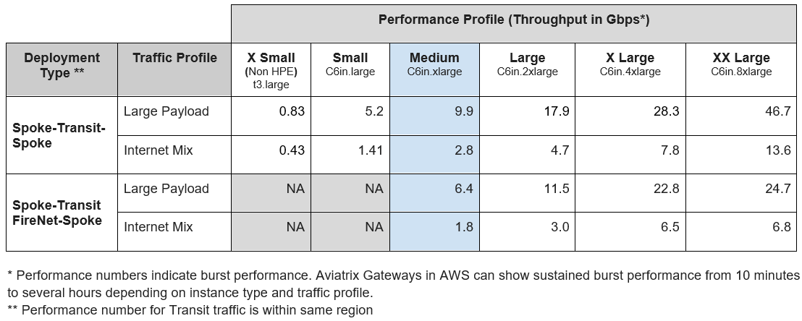
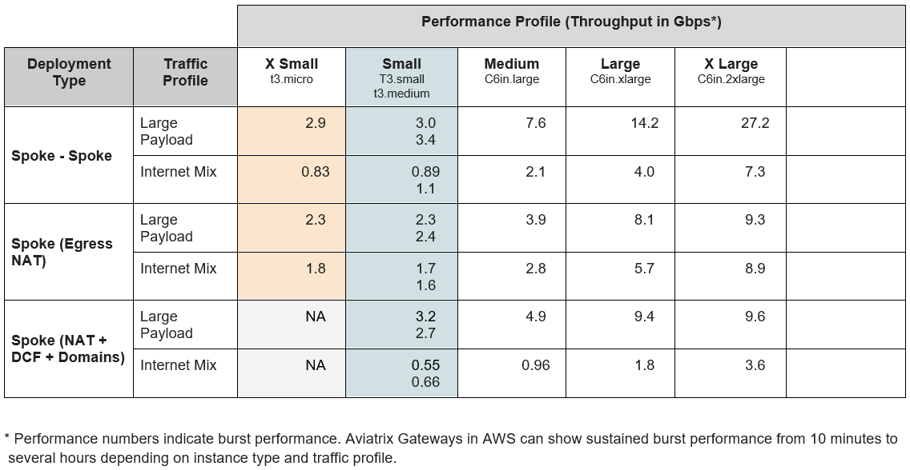

# Gateway Sizing Best Practices Guide

Although Aviatrix supports a wide array of instance types and sizes in each cloud, this reference guide provides data about gateway sizing and common deployments by other Aviatrix customers to assist you with pre-deployment planning, as well as to help right-size current deployments to maximize cost savings and efficiency.

> **Note:** This data is for guidance purposes only and is based on Aviatrix Controller software version 7.2.4820. Every environment may perform differently.

## Gateway Size Distribution

Transit Gateways are typically larger because they serve as the hub of a hub-and-spoke architecture, terminating multiple Spoke Gateways. This means Transit Gateways need more IPsec throughput and performance compared to Spoke Gateways, which service only one VPC/VNET/VCN of workloads.

The following tables and graphs (see original documentation for images) show data for AWS and Azure cloud deployments:

### AWS Traffic and Deployments

#### Transit Gateway

- 
- 
- 

#### Spoke Gateway

- 
- 
- 
- 

### Azure Traffic and Deployments

#### Transit Gateway

- 
- 
- 

#### Spoke Gateway

- 
- 
- 
- 

## Bandwidth and Performance

Gateway performance is impacted by packet size. In Aviatrix internal testing, both best-case large payload numbers and Internet Mix (iMix) numbers of varying packet sizes were used to reflect more real-world performance numbers.

> **Important:** The information provided in this document is based on Aviatrix's internal testing. Your network will differ from the testing environment used by Aviatrix. Use this guide as reference only to plan your deployment or drive efficiency in your current deployment.