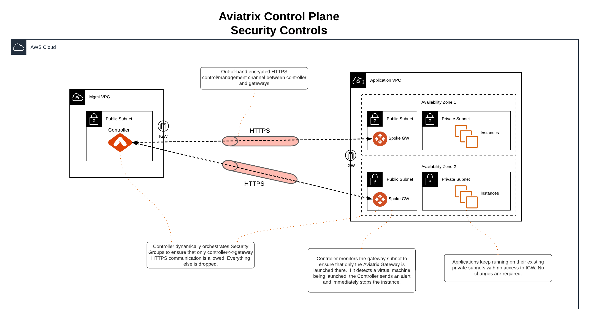

# Secure VPCs Best Practices Guide

In today's cloud-centric world, securing Virtual Private Clouds (VPCs) and Virtual Networks (VNets) is paramount. Modern cloud architectures leverage the performance and security capabilities of Cloud Service Provider (CSP) networks to allow applications to directly egress and ingress to and from the Internet without having to hairpin traffic through on-premises datacenters. This requires the deployment of public IPs in the cloud for Internet connectivity, in conjunction with robust security controls to ensure that no services are improperly exposed.

The Aviatrix solution leverages these capabilities to build a secure multi-cloud control plane across AWS, Azure, GCP, and OCI. This document explains how Aviatrix features can significantly enhance the security of VPCs and VNets, focusing on the necessity of public IPs for the control plane and the accompanying security controls to block unauthorized access.

## Aviatrix Public IP Requirement
Aviatrix architecture provides a clear separation between control and data plane functions. The Aviatrix control plane uses public IPs and the HTTPS protocol to establish an out-of-band encrypted connection between the Aviatrix Controller and gateways to exchange configuration and state data. This ensures that control functions, such as software upgrades, can be performed without impacting service, while configuration and state changes in the data plane do not affect the control plane.

## Control Plane Security Controls
Aviatrix offers several security controls to protect the control plane:

- **Security Group Management:** Ensures that only Controller and gateway IPs can connect to each other on TCP/443 for control plane purposes. Security groups are dynamically updated whenever a new gateway is created or deleted, or if there is a change to the Controller IP.
- **Isolated Gateway Subnets:** Applications can remain in their existing private subnets, while Aviatrix gateways are deployed in isolated public subnets for control plane connectivity. Access to these subnets or the Internet Gateway (IGW) can be restricted via IAM policies.
- **Gateway Subnet Monitoring (Controller only):** If your company policy is that no VM instances can be launched on public subnets, this feature allows you to enforce that no unauthorized virtual machine instances are being launched on the gateway subnet. The Controller periodically monitors the selected subnet, sends alerts, and stops unauthorized instances if detected.

> **Note:** Aviatrix gateways must be launched on a public subnet (AWS, GCP, OCI).
